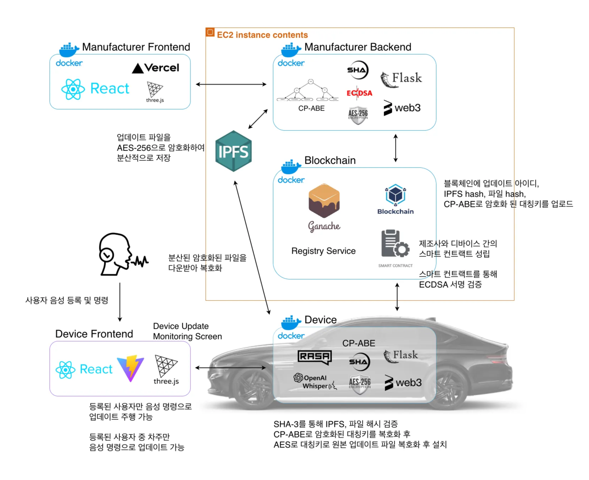
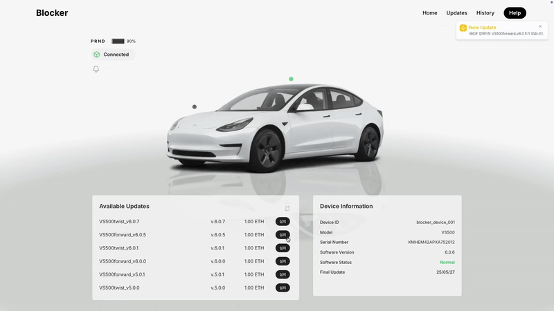

# 1. 블록체인 기반 IoT 소프트웨어 업데이트 플랫폼

프로젝트 유형: 산학협력(현대자동차), 2025 오픈소스 개발자대회, 캡스톤디자인
프로젝트 설명: 블록체인 + CP-ABE + IPFS + 음성인식을 결합한 분산형 OTA 프레임워크

무단 접근, 위조, 결제 미이행 등의 보안 위협 차단
블록체인을 통해 감사 및 컴플라이언스 대응에 용이
현대자동차 산학협력 프로젝트
2025 한성대학교 캡스톤디자인 우수상
사용 기술: Blockchain, 스마트컨트랙트, Solidity, Web3, Ganache, IPFS, CP-ABE, ECDSA, AES-256, SHA-256, LLM, Whisper, NLU, 화자인식, MCP, Python, Flask, JavaScript, TypeScript, React, Docker, Swagger
담당 역할: 암호 모듈, 제조사&디바이스 백엔드(Flask), 블록체인&IPFS 연동, 화자인식, 디바이스 취약점 진단
작업기간: 2025년 2월 3일 → 2025년 10월 27일
GitHub 링크: https://github.com/HSU-Blocker

디바이스 대시보드

## ***Overview***

---

### IoT 기기의 안전한 소프트웨어 업데이트를 위한 블록체인 + CP-ABE + IPFS 기반 분산형 OTA 프레임워크

- **블록체인**을 통해 업데이트 기록의 위·변조를 방지하여 **컴플라이언스에 대응**
- **스마트 컨트랙트**를 통해 업데이트의 배포와 결제를 **원자적**으로 처리하고, **IPFS**로 대용량 업데이트 파일을 효율적으로 **분산 관리**
- **CP-ABE(속성 기반 암호화)** 기법을 적용하여 제조사의 정책과 일치하는 속성을 가진 디바이스만 복호화 가능
- **오픈소스** 공개 및 FOSSA, GitHub Dependabot 및 Code Scanning을 활용해 **라이선스 및 의존성, 보안 취약점을 점검**

### 현대자동차 산학협력 프로젝트 기반 자율주행 음성 명령 및 OTA 음성 업데이트 연동 차량 인터페이스 구조

- **Hugging Face** 기반 **화자 인식** 인증을 적용해 등록된 사용자만 자율주행 관련 음성 명령을 수행하도록 구성
- 차주로 등록된 사용자에 한해 음성으로 OTA 업데이트 요청, 승인, 보류, 설명 조회까지 수행할 수 있도록 권한을 분리
- 음성 명령어를 **LLM** 및 **NLU**로 해석해 "업데이트 요청", "승인" 등 OTA 의도와 자율주행 명령으로 매핑
- **MCP**를 도입해 기존 업데이트 내역과의 차이를 분석하고, 관련 질의에 자연어로 응답하도록 구성
- **STT** 및 **TTS** 기술을 적용해 **다국어** 환경에서도 차량 음성 인터페이스를 사용할 수 있도록 확장

## *Tech Stack*

---

서비스 아키텍처

| 구분 | 내용 |
| --- | --- |
| **Blockchain** | Solidity, Ganache, Web3, 스마트컨트랙트 |
| **Security** | CP-ABE, AES-256, SHA3-256, ECDSA |
| **Distributed File System** | IPFS |
| **AI** | STT/TTS, RASA, LLM, NLU, MCP |
| **Backend** | Python, Flask, Swagger |
| **DevOps** | Docker, AWS |
| **Frontend** | React, Vite, TypeScript, JavaScript, Three.js, Vercel |

## *P**articipants***

---

- **총 7명**: 학부생 5명, 참여교수 1명, 기업체 1명 (현대자동차 책임연구원)

## ***Main Features***

---

### 1. Manufacturer

제조사 소프트웨어 업데이트 메인 화면

제조사 접근 제어 정책 등록

제조사 등록 업데이트 목록 조회

제조사 업데이트 프로세스 시각화

**제조사 주요 기능**

1. **업데이트 파일**을 **AES-256으로 암호화**하고, 생성된 **대칭키(kbj)** 를 **CP-ABE로 암호화**하여 **접근 제어 정책** 적용
2. 암호화된 파일(Es)에 대해 **SHA3-256 해시 값을 생성**하여 **무결성 검증 기준값(hEbj)** 확보
3. 암호화된 파일을 **IPFS에 업로드**하고, 해당 파일의 **콘텐츠 식별자(CID)** 를 획득
4. 업데이트 UID, IPFS 해시(CID), 암호화된 키(encrypted_key)를 **스마트 컨트랙트에 등록**
5. 등록된 데이터를 **ECDSA 개인키로 서명**하고, **서명 결과를 블록체인에 함께 기록**하여 **위변조 방지**
6. **스마트 컨트랙트**를 통해 **소프트웨어 업데이트의 배포 및 결제** 를 **원자적(Atomic)으로 처리**
7. 배포된 **스마트 컨트랙트 주소**를 **레지스트리 컨트랙트에 자동 등록**하여 다른 서비스에서 **중앙 참조** 가능하도록 구성
8. **Three.js**를 활용하여 블록체인 및 IPFS 기반 소프트웨어 업데이트 등록 과정을 시각화

### 2. Device

디바이스 메인 대시보드 화면 & 업데이트 알림 및 설치 과정

디바이스 업데이트 설치 프로세스 시각화 - 블록체인 & IPFS 정보 다운로드

디바이스 업데이트 설치 프로세스 시각화 - CP-ABE, AES-256 복호화 시각화 및 업데이트 파일 설치

업데이트 후 디바이스 동작

**디바이스 주요 기능**

1. 블록체인에서 **새로운 소프트웨어 업데이트 등록 이벤트를 감지**
2. **IPFS에서 암호화된 업데이트 파일(Es)** 을 다운로드
3. 다운로드된 파일의 **SHA3-256 해시 값을 계산**하고, 등록된 기준 해시(**hEbj**)와 비교하여 **무결성 검증 수행**
4. **CP-ABE로 암호화된 대칭키(encrypted_key)** 를 복호화하여 **원본 대칭키(kbj)** 획득
5. 복호화한 **kbj를 직렬화한 뒤 SHA-256 해싱**하여 **AES-256 키 생성**
6. 생성된 **AES 키를 사용해 업데이트 파일을 복호화**하여 **원본 파일(bj)** 복원
7. 복호화 및 검증이 완료된 파일을 **디바이스에 설치**하고, **설치 완료 여부를 스마트 컨트랙트를 통해 블록체인에 기록**
8. **Three.js**를 활용하여 블록체인 및 IPFS 기반 소프트웨어 업데이트 설치 과정 시각화
9. 업데이트 설치 완료 후, 실제 **IoT 기기의 동작(직진, 후진 등)** 을 수행하여 소프트웨어 적용 결과 확인

### **3. speech recognition**

AI 음성 비서 - LLM & NLU 기반 음성 인식 STT/TTS로 음성 확인, 화자 인식을 통해 등록 사용자 구분

### **음성 기반 OTA 업데이트**

- 화자 인식 기능을 통해 차주만이 음성 명령으로 업데이트 요청, 승인, 보류, 설명 등의 상호작용을 수행할 수 있도록 제한
- MCP를 활용하여 기존 업데이트 내역과의 차이점을 분석하고, 사용자 질의에 대해 자연어로 응답 제공
- LLM과 NLU 기술을 활용하여, 사용자의 다양한 표현 방식과 의도를 정밀하게 파악하고 업데이트 관련 의도를 자연스럽게 안내
- STT 및 TTS 기술을 적용하여 다양한 언어 환경에서도 음성 인터페이스를 지원

### 음성 기반 자율주행

- 직진, 멈춤, 특정 장소(학교, 회사, 병원 등)로 이동의 자율주행을 음성으로 가능
- LLM과 NLU 기술을 통해 다양한 문장 구조나 말투로 전달된 명령을 이해하고, 자율주행 기능과 연동하여 실행
- 음성 기반 OTA 업데이트와 마찬가지로 STT 및 TTS 기술을 적용하여 다양한 언어 환경에서도 음성 인터페이스를 지원

## *참여 기업체(현대자동차) 역할 및 내용 (자문, 평가 등)*

---

### OTA 연계 음성 인터페이스 기능 제안

- 기존 OTA 기능과 음성 인식 기술 간의 연관성이 부족하므로, 음성 인터페이스와 OTA 기능의 통합 구현 기능을 제안함
- 음성 명령을 통해 “기존의 업데이트 내역과 달라진 점은 무엇인가?”와 같은 질문에 대해 자연어로 응답 할 수 있도록, OTA 데이터 기반의 LLM 응답 기능을 구축하고, MCP를 통해 LLM 과의 통신을 처리하는 기능을 제안함

### 음성 명령 처리 기술 자문

- 차량 제어와 관련된 기본 명령어는 NLU를 통해 처리가 가능함
- 다만, 복잡한 일상 대화나 자연스러운 대화 상황에서는 NLU만으로는 대응이 어려워 고도화된 연계 기술이 필요함

## ***Expected Impact***

---

1. **보안 위협 차단**
    
    IoT 기기의 소프트웨어 업데이트 과정에서 발생할 수 있는 무단 접근, 위조, 결제 미이행 등의 보안 위협을 차단하고 기기 인증 및 데이터 무결성을 보장
    
2. **신뢰성 확보**
    
    CP-ABE를 통해 제조사의 정책과 일치하는 속성을 가진 디바이스만 복호화가 가능하며, 블록체인 및 스마트 컨트랙트를 통해 결제 및 배포 과정의 신뢰성을 강화
    
3. **감사 가능성**
    
    모든 업데이트 내역이 블록체인에 투명하게 기록되어 조작이 불가능하고, 감사 및 컴플라이언스 대응이 용이
    
4. **확장성 및 고가용성**
    
    IPFS 기반의 파일 분산 저장 구조를 통해 대규모 IoT 환경에서도 뛰어난 확장성과 고가용성을 제공
    

## *Contributions*

---

1. **CP-ABE**와 **AES-256**을 활용해 소프트웨어 업데이트 파일 **암·복호화** 로직을 구현하고, 속성 기반 접근 제어를 적용
2. **SHA3-256 해시 기반 무결성 검증**과 블록체인 스마트 컨트랙트의 **ECDSA 서명**을 통해 업데이트 데이터의 위·변조 방지 구조를 구축
3. 제조사&디바이스 **백엔드를** 개발하여 업데이트 파일 등록 및 정책 기반 배포 관리 기능 구현
4. **Hugging Face** 기반 **화자 인식** 모델을 적용하여 등록된 사용자만 음성 자율주행 기능을 사용, 등록된 사용자 중 차주만 음성 OTA 업데이트를 승인·제어할 수 있는 인증 구조를 구현
5. FOSSA, GitHub Dependabot 및 Code Scanning을 활용해 디바이스 코드의 **라이선스 및 의존성, 보안 취약점을 점검**

## *Problem Solving*

---

### 1. CP-ABE(속성 기반 암호화) 실행 환경 종속성 이슈

- **문제**: CP-ABE 라이브러리가 Ubuntu 기반 환경에서만 정상 동작하여 파이썬 가상환경에서는 실행 불가
- **해결**:
    - **Docker 도입으로 Ubuntu 기반 실행 환경을 컨테이너로 표준화**
    - 필요한 패키지/의존성을 런타임을 이미지에 고정하여 환경 차이 제거
    - 개발/배포 환경에서 일관되게 실행 가능하도록 개선

## ***Resources***

---

프로젝트 링크

- GitHub: [https://github.com/HSU-Blocker](https://github.com/HSU-Blocker)
- 제조사 배포 링크: [Blocker Industry](https://blocker-industry-1kqcrsw6j-3duck1s-projects.vercel.app/) *(서버 비용으로 인해 현재 서비스 중단)*

시연 및 발표 자료

- OTA 업데이트 시연: [YouTube 바로가기](https://www.youtube.com/watch?v=dioYtYY6i1s)
- 음성 인식 시연: [YouTube 바로가기](https://www.youtube.com/watch?v=7OC74EscidU)
- 발표 자료: [Google Drive](https://drive.google.com/file/d/1ifnjPr42raM00BIkfwm06hml2uO9LvC6/view?usp=sharing)
- 기능 명세서: [Google Docs](https://docs.google.com/document/d/1PEms1QIIVMfoxa3eu1heeL7NMREJWXry/edit?usp=sharing&ouid=104382857428857441544&rtpof=true&sd=true)
- 판넬: [Google Drive](https://drive.google.com/file/d/1x1ZWG9rcYPithvhM2MS_Q5iHorgUx7la/view?usp=sharing)
