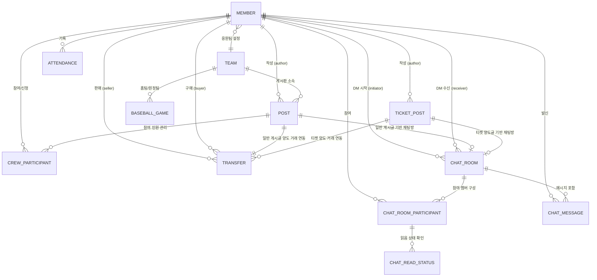

# 1. 도메인 설계서 (5조)

## 문서 정보

- **프로젝트명**: 풀카운트 (Full Count) - 야구 팬 커뮤니티 및 직관/티켓 양도 플랫폼
- **작성자**: [풀카운트/안진경, 박미정]
- **작성일**: [2026-04-06]
- **버전**: [v1.1]
- **검토자**: [안진경, 김어진, 박미정, 이시연, 이준호]
- **승인자**: [안진경, 김어진, 박미정, 이시연, 이준호]

---

## **1. 프로젝트 개요**

### **1.1 프로젝트 목적**

```
야구 팬들에게 팀별 소속감을 부여하는 전용 커뮤니티를 제공하고,사기 피해 걱정 없는 안전한 에스크로 기반 티켓 양도 및 직관 동행 모집 시스템을 구축하여 팬들의 야구 관람 경험을 개선하고 건전한 팬 문화를 조성한다.
```

### **1.2 프로젝트 범위**

**포함 범위:**

- [x]  회원 관리 (가입, 응원 팀 선택, 뱃지 등급 관리, 직관 달력)
- [x]  커뮤니티 관리 (직관 메이트(동행) 게시판, 같은 팀 크루 모집 게시판)
- [x]  양도 관리 (티켓 양도글 작성, 에스크로 결제)
- [x]  실시간 소통 (1:1 채팅 및 직관 그룹 채팅)
- [x]  KBO 경기 일정 확인 및 실시간 라이브 채팅
- [x]  관리자 대시보드 (모니터링, 멤버 비활성화, 양도 취소, 게시글 삭제 등)

**제외 범위:**

- [ ]  KBO 공식 티켓 예매 시스템 연동 및 발권 (개인 간 양도만 취급)
- [ ]  야구 외 타 종목 커뮤니티
- [ ]  KBO 실시간 중계 영상 스트리밍

### **1.3 주요 이해관계자 (Stakeholders)**

| **구분** | **역할** | **주요 관심사** |
| --- | --- | --- |
| **야구 팬 (일반)** | 시스템 사용자 | 같은 팀 팬들과의 소통, 직관 메이트 구하기 |
| **티켓 양도/양수자** | 시스템 사용자 | 사기 위험 없는 안전한 티켓 거래 |
| **시스템 관리자** | 시스템 운영자 | 암표 및 비매너 유저 모니터링, 플랫폼 안정성 |
| **운영팀 (CS)** | 고객 지원 | 거래 분쟁 조정, 신고 접수 및 처리 |

---

## 2. 비즈니스 도메인 분석

### 2.1 핵심 비즈니스 프로세스

### 2.1.1 회원 온보딩 및 활동 등급 체계

사용자가 서비스에 가입하고 특정 구단의 팬으로서 정체성을 확립하며 활동에 따른 보상을 받는 과정

- **프로세스 상세:**
    1. **가입 및 인증:** 이메일 기반 가입 절차를 진행하며, 중복 방지를 위해 이메일 및 닉네임 검증 후 이메일 인증을 완료
    2. **응원 팀 설정:** KBO 10개 구단 중 1개를 선택합니다. 이는 서비스 내 UI 테마, 전용 게시판 접근 권한, 기본 팀 뱃지 부여의 기준이 됨
    3. **활동 등급 관리:** 직관 인증(티켓 사진 업로드), 커뮤니티 활동량 등을 종합하여 **ROOKIE → PRO → ALL_STAR → LEGEND** 등급으로 자동 승급
- **비즈니스 규칙:**
    - 응원 팀은 시즌 중 1회만 변경 가능하여 무분별한 데이터 변경을 방지합니다.
    - 등급에 따라 서비스 내 권한이나 뱃지 노출이 달라짐

### 2.1.2 직관 메이트 및 크루 매칭 프로세스

일회성 동행(메이트)과 지속적 소모임(크루)을 통해 팬들 간의 오프라인 네트워킹을 지원

- **프로세스 상세:**
    1. **모집 게시글 등록:** 모집자(작성자)가 경기 일정, 모집 인원, 선호 구역 등을 명시하여 게시글을 등록
    2. **참여 신청 및 관리:** 참여 희망자가 신청을 하면, 모집자는 신청자의 프로필과 메시지를 확인하여 승인 여부를 결정
    3. **소통 채널 자동화:** 
        - **메이트:** 모집 정원이 충족되는 즉시 자동으로 **그룹 채팅방** 생성
        - **크루:** 가입 전 궁금한 점을 위해 **1:1 문의 채팅**을 지원하며, 확정 시 전용 채팅방에서 소통
- **비즈니스 규칙:**
    - 모집 정원을 초과한 신청은 불가능하며, 모집 완료 시 게시글 상태가 자동으로 '마감' 처리됩니다.

### 2.1.3 티켓 양도 및 에스크로 안전 거래

투명한 티켓 거래 환경을 구축하고 암표 및 사기 피해를 방지

- **프로세스 상세:**
    1. **양도 등록:** 티켓 정보(구역, 좌석 번호 등)를 포함하여 글을 등록
    2. **양도 요청 및 채팅:** 양수자가 '양도 요청' 클릭 시 1:1 채팅방이 자동 개설되어 상세 조율을 진행
    3. **에스크로 결제:** 양수자가 결제한 대금은 플랫폼이 안전하게 보관하며, 양도자는 티켓을 전달
    4. **거래 확정 및 정산:** 양수자가 '인수 확정'을 누르면 대금이 양도자에게 정산됨
- **비즈니스 규칙:**
    - **프리미엄 제한:** 양도 가격은 정가를 초과할 수 없도록 제한하여 건전한 거래 문화를 지향
    - **자동 거래 확정:** 인수 확정이 지연될 경우, 경기 시작 24시간 후 시스템이 자동으로 거래 완료 처리

### 2.1.4 KBO 실시간 데이터 연동 및 기록

실시간 경기 정보를 제공하고 사용자의 직관 기록을 자산화

- **프로세스 상세:**
    1. **데이터 실시간 노출:** 외부 API 연동을 통해 당일 경기의 스코어, 이닝, 실시간 상황을 홈 화면에 제공
    2. **라이브 응원 톡:** 경기 진행 시간 동안 실시간 채팅방을 활성화하여 팬들 간의 소통을 유도
    3. **직관 기록(디지털 아카이브):** 경기가 종료되면 사용자는 '직관 달력'에 승패 여부와 티켓 사진을 기록하여 개인 통계를 관리

---

### 2.2 비즈니스 이벤트

| 이벤트 | 발생 트리거 | 비즈니스 결과 및 시스템 동작 |
| --- | --- | --- |
| **회원 가입 완료** | 이메일 인증 성공 | 회원 계정 활성화, 선택 팀의 기본 뱃지 자동 부여 |
| **메이트 모집 완료** | 모집 인원 = 승인 인원 | 게시글 상태 '마감' 변경, **그룹 채팅방 자동 생성** |
| **양도 요청 발생** | 양수자의 요청 버튼 클릭 | 해당 양도글 '예약중' 전환, **1:1 전용 채팅방 개설** |
| **안전 결제 완료** | 결제 게이트웨이 승인 | 대금 에스크로 보관, 양도자에게 티켓 전달 요청 알림 |
| **거래 확정(정산)** | 양수자 확정 클릭 또는 24시간 경과 | 양도자 정산 처리, 거래 참여자 매너 온도/등급 점수 업데이트 |
| **활동 등급 상승** | 설정된 활동 포인트 도달 | 뱃지 등급 업그레이드 알림 전송 및 권한 변경 |
| **경기 결과 확정** | KBO 공식 경기 종료 데이터 수신 | 실시간 채팅 종료 및 직관 달력 '기록하기' 활성화 유도 |

---

## **3. 기능 요구사항 (Functional Requirements)**

### **3.1 회원 관리**

| **FR ID** | **기능명** | **설명** | **우선순위** |
| --- | --- | --- | --- |
| **FR-M001** | **회원가입** | 이메일/닉네임/비밀번호 입력 후 이메일 인증 완료 시 가입 처리 | **높음** |
| **FR-M002** | **로그인/로그아웃** | 이메일 기반 로그인, JWT 방식 | **높음** |
| **FR-M003** | **응원 팀 선택** | 가입 시 KBO 10개 구단 중 1개 선택, 시즌 중 1회 변경 가능 | **높음** |
| **FR-M004** | **회원 정보 수정** | 닉네임, 프로필 이미지, 비밀번호 변경 | **중간** |
| **FR-M005** | **직관 달력** | 멤버가 직관한 기록을 캘린더에 승리 여부, 티켓 사진 등을 기록 | **중간** |
| **FR-M006** | **뱃지 등급 관리** | 활동 점수에 따라 ROOKIE → PRO → ALL_STAR → LEGEND 자동 승급 | **낮음** |

### **3.2 KBO 경기 일정 및 실시간 결과 관리**

| **FR ID** | **기능명** | **설명** | **우선순위** |
| --- | --- | --- | --- |
| **FR-K001** | **실시간 경기 현황 조회** | 홈 화면에서 당일 예정된 경기의 진행 상태, 실시간 스코어 및 주요 상황(이닝 등)을 실시간으로 노출 | **높음** |
| **FR-K002** | **KBO 경기 일정 조회** | 월별 및 구단별 필터를 적용하여 시즌 전체 경기 일정을 조회할 수 있는 기능 제공 | **높음** |
| **FR-K-=003** | **실시간 라이브 응원 채팅** | 진행 중인 경기별 채팅방에 참여하여 텍스트 메시지 및 이모티콘을 통해 실시간 응원 소통 기능 제공 | **중간** |

### **3.3 직관 메이트 모집 게시판**

| **FR ID** | **기능명** | **설명** | **우선순위** |
| --- | --- | --- | --- |
| **FR-MP001** | **직관 메이트 게시판 관리** | 직관 동행 모집을 위한 게시글 등록, 조회, 수정, 삭제 기능 제공 (수정/삭제는 작성자 본인만 가능) | **높음** |
| **FR-MP002** | **직관 메이트 참여 신청** | 모집 정원 초과 전까지 해당 게시글에 대한 동행 신청 기능 | **중간** |
| **FR-MP003** | **직관 메이트 그룹 채팅** | 메이트 모집 완료(정원 충족) 시, 참여 인원들이 소통할 수 있는 전용 그룹 채팅방 생성 및 운영 | **중간** |
| **FR-MP002** | **직관 메이트 신청자 관리** | 메이트 모집 글에 신청한 신청자들의 메시지, 프로필 확인 | **중간** |

### **3.4 크루 모집 게시판**

| **FR ID** | **기능명** | **설명** | **우선순위** |
| --- | --- | --- | --- |
| **FR-C001** | **크루 모집 게시판 관리** | 동일 팀 팬 중심의 크루 모집 게시글 등록, 조회, 수정, 삭제 기능 제공 (수정/삭제는 작성자 본인만 가능) | **높음** |
| **FR-C002** | **크루 참여 신청** | 모집 정원 초과 전까지 해당 크루에 대한 가입 신청 기능 | **중간** |
| **FR-C003** | **크루 그룹 채팅** | 크루 멤버 확정 시, 크루원들이 소통할 수 있는 전용 그룹 채팅방 생성 및 운영 | **중간** |
| **FR-C004** | **크루 1:1 문의 채팅** | 크루 가입 전, 모집 작성자(크루장)에게 궁금한 점을 확인할 수 있는 1:1 채팅 기능 | **낮음** |

### **3.5 티켓 양도 게시판**

| **FR ID** | **기능명** | **설명** | **우선순위** |
| --- | --- | --- | --- |
| **FR-T001** | **양도글 등록** | 티켓 정보(구역, 가격 등) 게시글 등록 | **높음** |
| **FR-T002** | **양도 요청** | 양수자가 양도 요청 클릭 → 채팅방 자동 개설 | **높음** |
| **FR-T003** | **에스크로 결제** | 양수자 결제 시 플랫폼이 대금 보관, 인수 확정 후 정산 | **높음** |
| **FR-T004** | **자동 거래 확정** | 경기 시작 24시간 후 미확정 거래 자동 완료 처리 | **낮음** |

### **3.6 실시간 채팅**

| **FR ID** | **기능명** | **설명** | **우선순위** |
| --- | --- | --- | --- |
| **FR-CH001** | **1:1 채팅** | 티켓 양도 거래 및 개별 문의를 위한 사용자 간 1:1 채팅 기능 제공 | **높음** |
| **FR-CH002** | **그룹 채팅** | 모집 게시글(직관 메이트/크루) 기반의 다자간 소통 지원 및 정원 기반 입장 제한 | **중간** |
| **FR-CH003** | **미확인 메시지 표시** | 채팅 목록 및 방 내부에서 읽지 않은 메시지 개수(Badge) 실시간 표시 | **중간** |
| **FR-CH004** | **푸시 알림 서비스** | 신규 메시지 수신, 거래 상태 변경, 매너 평가 요청 등 주요 이벤트 알림 전송 | **중간** |

---

## **4. 비기능 요구사항 (Non-Functional Requirements)**

### **4.1 성능**

| **NFR ID** | **항목** | **목표** |
| --- | --- | --- |
| **NFR-P001** | 응답 시간 | 일반 API 평균 응답 ≤ 300ms |
| **NFR-P002** | 채팅 지연 | WebSocket 메시지 지연 ≤ 500ms |
| **NFR-P003** | 동시 접속 | 동시 접속자 500명 이상 처리 |

### **4.2 보안**

| **NFR ID** | **항목** | **목표** |
| --- | --- | --- |
| **NFR-S001** | 인증 | JWT 기반 Access/Refresh Token 발급 |
| **NFR-S002** | 권한 관리 | Spring Security 기반 역할별 접근 제어 (USER, ADMIN) |
| **NFR-S003** | 결제 보안 | 에스크로 상태 전이는 서버 사이드에서만 처리 |

### **4.3 기술 스택**

| **구분** | **기술** |
| --- | --- |
| **Backend** | Java 17, Spring Boot 3.2.5, Spring Security, Spring Data JPA, Thymeleaf |
| **Frontend** | JavaScript, React, Vite, ESLint, Axios |
| **Database** | MySQL 8.x (운영), H2 (테스트) |
| **실시간 채팅** | WebSocket, STOMP, SockJS |
| **빌드** | Gradle |
| **API 문서** | Swagger (SpringDoc) |

---

## 5. 도메인 객체 (Domain Objects)

### 5.1 도메인 객체 식별 매트릭스

| 도메인 객체 | 유형 | 중요도 | 설명 |
| --- | --- | --- | --- |
| **Member** | Entity | 높음 | 회원 계정, 권한, 잔액, 알림 설정 관리 |
| **Team** | Entity | 높음 | 응원 팀 및 경기 연관 팀 기준 정보 |
| **Post** | Entity | 높음 | 크루, 메이트, 양도, 팀 전용 게시글을 통합 관리 |
| **CrewParticipant** | Entity | 높음 | 크루 게시글 참여자 및 리더 여부 관리 |
| **Transfer** | Entity | 높음 | 티켓 양도 거래 상태 머신 |
| **ChatRoom** | Entity | 높음 | 게시글 기반 채팅 및 직접 DM 방 |
| **ChatRoomParticipant** | Entity | 중간 | 채팅방 참여 회원 매핑 |
| **ChatMessage** | Entity | 중간 | 채팅 메시지 및 입장/퇴장 이벤트 저장 |
| **ChatReadStatus** | Entity | 중간 | 채팅 메시지 읽음 여부 |
| **RefreshToken** | Entity | 중간 | 회원별 리프레시 토큰 보관 |
| **Attendance** | Entity | 중간 | 직관 기록, 결과, 인증 이미지, 메모 저장 |
| **BaseballGame** | Entity | 중간 | 외부 경기 API 수집 데이터 저장 |
| **TicketPost** | Entity | 중간 | 별도 티켓 판매 게시 모델 |
| **BadgeLevel / MemberRole / BoardType / PostStatus / TransferStatus / ChatRoomType / ChatMessageType / MatchResult / TicketPostStatus /**  | Enum / Value | 중간 | 상태값과 분기 규칙 정의 |

### 5.2 상세 도메인 객체 정의

### 5.2.1 Member (회원)

**역할**: 플랫폼 사용자의 인증, 프로필, 응원 팀, 거래 가능 상태를 관리하는 핵심 주체

**주요 속성:**

- `email`, `nickname`: 모두 유니크 제약이 있는 로그인/활동 식별값
- `password`: 암호화 저장 대상 비밀번호
- `team`: 응원 팀
- `badgeLevel`: 활동 등급
- `mannerTemperature`: 매너 온도, 기본값 36.5
- `role`: USER, ADMIN
- `isActive`: 계정 활성 여부
- `teamChangedThisSeason`: 시즌 중 팀 변경 여부
- `balance`: 충전 잔액
- `profileImageUrl`: 프로필 이미지
- `chatAlert`, `transferAlert`, `mannerAlert`: 알림 설정

**주요 행동:**

- `changeTeam()`: 시즌당 1회 팀 변경
- `upgradeBadge()`: 배지 등급 변경
- `updateMannerTemperature()`: 매너 온도 증감
- `charge()`, `deduct()`: 잔액 충전 및 차감
- `deactivate()`, `activate()`, `changeRole()`: 계정 상태 및 권한 변경

**핵심 규칙:**

- 이메일과 닉네임은 중복될 수 없음
- 잔액 부족 시 차감 불가
- 동일 시즌 내 팀 재변경 불가

### 5.2.2 Team (구단)

**역할**: 회원의 응원 팀, 게시글의 경기 팀, 홈구장 정보를 제공하는 기준 마스터 데이터

**주요 속성:**

- `name`: 팀명
- `shortName`: 축약명
- `homeStadium`: 홈구장

### 5.2.3 Post (통합 게시글)

**역할**: 크루 모집, 메이트 모집, 티켓 양도, 팀 전용 게시글을 하나의 엔티티로 운영

**주요 속성:**

- `author`: 작성자 회원
- `team`: 팀 전용 게시판 대상 팀
- `homeTeam`, `awayTeam`: 경기 매칭 팀
- `supportTeam`: 응원 팀
- `boardType`: CREW, MATE, TRANSFER, TEAM_ONLY
- `title`, `content`: 제목, 내용
- `matchDate`, `matchTime`, `stadium`: 경기 정보
- `seatArea`, `ticketPrice`: 좌석 구역, 티켓 가격
- `maxParticipants`, `isPublic`, `tags`: 인원 제한, 공개 여부, 태그
- `status`: OPEN, RESERVED, CLOSED
- `viewCount`: 조회수

**주요 행동:**

- `reserve()`: 예약 상태 전환
- `close()`: 마감 처리
- `updateContent()`: 열려 있는 글만 수정
- `incrementViewCount()`: 조회수 증가
- `setTeams()`, `setSupportTeam()`, `setStadium()`, `setMatchDate()`: 경기 정보 세팅

**핵심 규칙:**

- RESERVED, CLOSED 상태 게시글은 수정 불가
- 게시글 유형에 따라 사용 필드가 다름
- 크루 게시글은 participants 컬렉션으로 참여자를 관리함

### 5.2.4 CrewParticipant (크루&메이트 참여)

**역할**: 크루&메이트 게시글과 회원의 참여 관계를 관리

**주요 속성:**

- `post`, `member`: 관련 게시글 및 회원
- `isLeader`: 방장/주최자 여부
- `applyMessage`: 참여 신청 메시지
- `joinedAt`: 참여 일시
- `isApproved`: 승인 일시

**핵심 규칙:**

- (post_id, member_id) 유니크 제약으로 동일 크루 중복 참여 방지

### 5.2.5 Transfer (양도 거래)

**역할**: 티켓 양도 게시글에 연결된 거래 흐름과 구매자/판매자 상태를 관리

**주요 속성:**

- `post`: 양도 게시글과 1:1 연결
- `seller`, `buyer`: 판매자, 구매자
- `price`: 가격
- `status`: REQUESTED, PAYMENT_COMPLETED, TICKET_SENT, COMPLETED, CANCELLED

**주요 행동:**

- `payEscrow()`: 구매자 지정 및 결제 완료 처리
- `markTicketSent()`: 판매자 전달 완료 처리
- `confirmTransfer()`: 인수 확정 및 거래 종료
- `cancelTransfer()`: 완료 전 거래 취소

**핵심 규칙:**

- 하나의 게시글에는 하나의 거래만 연결됨
- 상태 전이는 순서 제약을 가짐
- 완료된 거래는 취소 불가

### 5.2.6 ChatRoom (채팅방)

**역할**: 게시글 기반 채팅과 회원 간 직접 DM을 수용하는 대화 공간

**주요 속성:**

- `post`: 게시글 기반 채팅일 때만 연결
- `roomType`: ONE_ON_ONE, ONE_ON_ONE_DIRECT, GROUP_JOIN, GROUP_CREW
- `initiator`, `receiver`: 직접 DM 참여자
- `participants`: 채팅방 참여자 목록
- `messages`: 채팅 메시지 목록

**주요 행동:**

- `addParticipant()`: 중복 없이 참여자 추가

**핵심 규칙:**

- 직접 DM은 post 없이 생성 가능
- 게시글 기반 채팅은 post를 중심으로 생성 가능
- 동일 회원은 같은 채팅방에 중복 참여할 수 없음

### 5.2.7 ChatRoomParticipant (채팅방 참여자)

**역할**: 채팅방과 회원의 다대다 관계를 해소하는 연결 엔티티
**핵심 규칙**: (chat_room_id, member_id) 유니크 제약으로 중복 입장 방지

### 5.2.8 ChatMessage (채팅 메시지)

**역할**: 채팅 본문과 시스템 이벤트를 저장
**주요 속성:**

- `chatRoom`, `sender`: 해당 채팅방 및 발신자
- `content`: 메시지 내용
- `type`: CHAT, ENTER, LEAVE
- `createdAt`: 생성 일시

### 5.2.9 **ChatReadStatus (채팅 메시지 읽음 여부)**

**역할**: 채팅 메시지의 읽음 여부를 저장

**주요 속성:**

- `chatRoom`, `member`: 해당 채팅방 및 멤버
- `lastReadMessageId`: 마지막으로 읽은 채팅 메시지 아이디

### 5.2.10 RefreshToken (리프레시 토큰)

**역할**: 회원 세션 유지와 액세스 토큰 재발급을 지원
**주요 속성:**

- `token`: 유니크 토큰 문자열
- `memberId`: 회원 식별자, 유니크
- `expiryAt`: 만료 시각
**주요 행동**: `updateToken()`: 토큰 재발급 시 갱신
**핵심 규칙**: 회원당 하나의 리프레시 토큰만 허용

### 5.2.11 Attendance (직관 기록)

**역할**: 회원의 경기 관람 인증 및 회고를 저장
**주요 속성:**

- `member`: 회원
- `matchDate`: 경기 날짜
- `result`: 경기 결과 (WIN, LOSE, TIE)
- `imageUrl`: 인증 이미지 경로
- `memo`: 한 줄 메모

### 5.2.12 BaseballGame (경기 데이터)

**역할**: 외부 API에서 수집한 경기 정보를 내부 저장소에 적재
**주요 속성:**

- `gameId`: 외부 시스템 경기 식별자, 유니크
- `isCanceled`, `gameDate`, `gameTime`: 취소 여부, 날짜, 시간
- `homeTeam`, `awayTeam`: 홈/어웨이 팀 정보
- `homeScore`, `awayScore`: 실시간 스코어
- `stadium`, `status`: 구장 및 경기 상태

### 5.2.13 TicketPost (별도 티켓 게시 모델)

**역할**: Post 기반 통합 게시글과 별도로 운용되는 티켓 판매 게시 엔티티
**주요 속성:**

- `title`, `content`: 제목, 내용
- `homeTeam`, `awayTeam`: 경기 팀
- `matchDate`, `matchTime`, `stadium`: 일정 및 구장
- `seatArea`, `seatBlock`, `seatRow`: 상세 좌석 정보
- `price`: 가격
- `status`: TicketPostStatus
- `author`: 작성자
**주요 행동**: `updateStatus()`(상태 변경), `isOwnedBy()`(작성자 검증)
**해석 메모**: 현재 Post 기반 모델과 TicketPost가 공존하며, 추후 통합 여부를 결정함

---

## 6. 도메인 관계도

### 6.1 개념적 관계도 (Conceptual Map)



### 6.2 관계 상세 설명

| **관계 (A ↔ B)** | **카디널리티** | **설명** | **주요 제약 및 규칙** |
| --- | --- | --- | --- |
| **Team ↔ Member** | **1 : N** | 회원은 하나의 응원 팀을 선택하며, 하나의 팀에는 여러 회원이 소속될 수 있음 | 시즌 중 팀 변경은 1회로 제한하는 비즈니스 규칙을 적용할 수 있음 |
| **Member ↔ Post** | **1 : N** | 한 회원은 여러 개의 일반 게시글을 작성할 수 있음 | 게시글 유형에 따라 접근 권한과 노출 범위를 구분함 |
| **Member ↔ TicketPost** | **1 : N** | 한 회원은 여러 개의 티켓 양도 게시글을 작성할 수 있음 | 티켓 양도 게시글은 거래 및 채팅과 연결될 수 있음 |
| **Member ↔ Attendance** | **1 : N** | 회원은 여러 개의 직관 기록을 작성할 수 있음 | 날짜, 경기 결과, 이미지, 메모 등을 기록함 |
| **Post ↔ CrewParticipant** | **1 : N** | 하나의 모집 게시글에 여러 참여 신청자가 연결될 수 있음 | `(post_id, member_id)` 유니크 제약으로 중복 참여를 방지하는 구조를 둘 수 있음 |
| **Post ↔ Transfer** | **1 : 1** | 일반 게시글 기반 양도 거래는 하나의 거래 엔티티와 연결될 수 있음 | `Transfer.post`는 `@OneToOne`이며 `unique = true`로 관리됨 |
| **TicketPost ↔ Transfer** | **1 : N 또는 1 : 1 후보** | 현재 코드상 `Transfer.ticketPost`는 `@ManyToOne`이므로 하나의 티켓 양도글에 여러 거래 이력이 연결될 수 있는 구조임 | 실제 서비스 정책이 “게시글당 거래 1건”이라면 추후 1:1로 제한하는 설계 검토가 필요함 |
| **Post ↔ ChatRoom** | **1 : 0..1** | 일반 게시글을 기반으로 채팅방이 생성될 수 있음 | 현재 `ChatRoom.post`가 `@OneToOne`이므로 게시글당 채팅방은 최대 1개임 |
| **TicketPost ↔ ChatRoom** | **1 : 0..1** | 티켓 양도 게시글을 기반으로 별도의 채팅방이 생성될 수 있음 | 현재 `ChatRoom.ticketPost`가 `@OneToOne`이므로 티켓 게시글당 채팅방은 최대 1개임 |
| **Member ↔ Transfer** | **1 : N** | 회원은 판매자 또는 구매자로 여러 거래에 참여할 수 있음 | `seller_id`, `buyer_id`를 통해 역할을 구분하며, 구매자는 거래 진행 시점에 설정될 수 있음 |
| **Member ↔ ChatRoom** | **1 : N** | 회원은 DM 채팅방의 발신자(`initiator`) 또는 수신자(`receiver`)가 될 수 있음 | DM 채팅방에서만 사용되며, 게시글 기반 채팅방에서는 null일 수 있음 |
| **ChatRoom ↔ ChatRoomParticipant** | **1 : N** | 하나의 채팅방은 여러 참여자를 가질 수 있음 | `addParticipant()`를 통해 동일 회원의 중복 참여를 방지함 |
| **ChatRoom ↔ ChatMessage** | **1 : N** | 하나의 채팅방에는 여러 메시지가 누적됨 | 채팅방 삭제 시 메시지도 함께 제거되도록 cascade 및 orphanRemoval을 적용함 |
| **Member ↔ ChatMessage** | **1 : N** | 한 회원은 여러 채팅 메시지를 발송할 수 있음 | `ChatMessage.sender`를 통해 발신자를 추적함 |
| **ChatRoomParticipant ↔ ChatReadStatus** | **1 : N** | 하나의 참여자 정보에 대해 여러 읽음 상태 기록이 연결될 수 있음 | 메시지 읽음 여부, 마지막 읽은 시점 등을 관리하는 용도로 확장 가능함 |

### **6.3 관계 해석 시 유의사항**

- **다대다(N:M) 해소**: `Member`와 `Post`(크루 참여), `Member`와 `ChatRoom` 사이의 다대다 관계를 `CrewParticipant`와 `ChatRoomParticipant`라는 **연결 엔티티**를 통해 1:N 관계로 풀어내어 확장성을 확보
- **통합 게시글 모델 (Single Table Strategy)**: `Post` 엔티티가 `boardType`에 따라 크루, 메이트, 양도 기능을 통합 관리하되, 거래의 특수성이 강한 '양도'는 `Transfer`와 1:1로 분리하여 상태 머신을 독립적으로 관리
- **상태 추적의 정밀화**: 채팅 읽음 처리(`ChatReadStatus`)를 별도 도메인으로 분리하여, 대규모 채팅 환경에서도 성능 저하 없이 마지막 읽은 위치를 추적할 수 있도록 설계

---

## 7. 비즈니스 규칙 (Business Rules)

비즈니스 규칙은 회원 가입, 커뮤니티 이용, 직관 메이트/크루 모집, 티켓 양도, 채팅, 관리자 운영 전반에서 시스템이 반드시 보장해야 하는 정책과 제약 조건을 정의한다.

본 장의 규칙은 3장의 기능 요구사항과 5장의 도메인 객체 정의를 실제 서비스 운영 관점에서 해석한 기준이며, 도메인 상태 전이와 권한 판단의 근거로 활용한다.

### 7.1 회원 및 커뮤니티 규칙

회원 및 커뮤니티 영역은 사용자의 정체성, 팀 소속성, 게시판 접근 권한, 활동 이력의 일관성을 유지하는 것을 목적으로 한다.

| **규칙 ID** | **규칙 내용** | **우선순위** |
| --- | --- | --- |
| **BR-M001** | 회원은 가입 시 반드시 1개의 응원 팀을 선택해야 함 | 높음 |
| **BR-M002** | 팀 전용 비밀 게시판은 해당 팀을 선택한 유저만 열람/작성 가능 | 높음 |
| **BR-M003** | 응원 팀 변경은 프로야구 정규 시즌 중 1회로 제한됨 | 중간 |

### 7.1.1 회원 가입 및 식별 규칙

- 모든 회원은 가입 시 이메일, 닉네임, 비밀번호, 응원 팀 정보를 입력해야 함
- 이메일과 닉네임은 시스템 내에서 각각 유일해야 하며, 중복 값으로 가입할 수 없음
- 이메일 인증이 완료된 회원만 활성 상태로 전환될 수 있음
- 비밀번호는 평문으로 저장할 수 없으며, 암호화된 형태로만 저장해야 함
- 비활성화된 계정은 일반 사용자 기능을 사용할 수 없으며, 재활성화 전까지 로그인 또는 주요 활동이 제한됨

### 7.1.2 응원 팀 선택 및 변경 규칙

- 회원은 가입 시 반드시 1개의 응원 팀을 선택해야 함
- 응원 팀은 회원의 커뮤니티 정체성과 게시판 접근 권한의 기준이 됨
- 응원 팀 변경은 프로야구 정규 시즌 중 1회만 허용됨
- 시즌 중 팀 변경 이력이 이미 존재하는 경우 추가 변경은 불가함
- 응원 팀 변경 시 기존 활동 이력은 유지하되, 이후 접근 가능한 팀 전용 게시판과 UI 기준 정보는 변경된 팀 기준으로 반영됨

### 7.1.3 팀 전용 커뮤니티 접근 규칙

- 팀 전용 게시판은 해당 팀을 응원 팀으로 선택한 회원만 열람 및 작성 가능함
- 다른 팀 소속 회원은 팀 전용 게시판의 목록, 상세, 댓글, 작성 기능을 사용할 수 없음
- 운영자(Admin)는 모니터링 및 관리 목적상 모든 팀 게시판에 접근 가능함
- 팀 전용 게시판 권한은 Member의 team 정보와 Post의 team 정보 일치 여부를 기준으로 판단함

### 7.1.4 회원 활동 및 신뢰도 규칙

- 회원의 매너 온도는 거래 완료, 직관 활동, 신고 처리 결과 등에 따라 증가 또는 감소할 수 있음
- 활동 점수 기준을 충족하면 배지 등급은 자동 승급될 수 있음
- 관리자 판단 또는 누적 제재 기준 충족 시 회원은 비활성화될 수 있음
- 거래 사기, 반복 신고, 커뮤니티 운영 정책 위반은 제재 사유가 될 수 있음

### 7.2 게시글 운영 규칙

게시글 운영 규칙은 크루, 메이트, 양도, 팀 전용 게시판이 하나의 Post 모델로 통합 운영되는 구조에서 게시글 유형별 사용 가능 필드와 상태 제약을 정의한다.

### 7.2.1 게시글 공통 생성 규칙

- 모든 게시글은 작성자(author) 정보를 반드시 가져야 함
- 게시글은 boardType에 따라 CREW, MATE, TRANSFER, TEAM_ONLY 중 하나로 분류되어야 함
- 게시글 유형에 따라 필수 입력 항목이 달라질 수 있음
- 경기 기반 게시글은 경기 날짜, 시간, 구장, 팀 정보 등 경기 식별 정보가 포함될 수 있음
- 게시글 생성 후 status의 기본값은 OPEN이어야 함

### 7.2.2 게시글 수정 및 삭제 규칙

- 게시글 수정 및 삭제는 기본적으로 작성자 본인만 가능함
- 관리자(Admin)는 운영 목적상 게시글 삭제 또는 비공개 처리 권한을 가질 수 있음
- RESERVED 또는 CLOSED 상태의 게시글은 내용 수정이 불가능함
- 게시글 수정 시 boardType에 맞지 않는 필드 조합은 허용되지 않음
- 조회수(viewCount)는 게시글 열람 이벤트에 따라 증가하며, 수정 시 초기화되지 않음

### 7.2.3 게시글 유형별 필드 사용 규칙

- CREW 및 MATE 게시글은 모집 인원(maxParticipants)과 신청/참여 관리 정보가 중요하게 사용됨
- TRANSFER 게시글은 티켓 가격(ticketPrice), 좌석 구역(seatArea), 경기 정보가 핵심 필드로 사용됨
- TEAM_ONLY 게시글은 특정 team 정보가 반드시 매핑되어야 함
- boardType에 따라 사용하지 않는 필드는 비워둘 수 있으나, 잘못된 조합으로 저장되어서는 안 됨

### 7.3 직관 메이트 및 크루 모집 규칙

직관 메이트 및 크루 모집 규칙은 모집형 게시글의 정원, 참여 신청, 승인, 채팅방 전환 등 오프라인 동행 형성 과정의 제약을 정의한다.

| **규칙 ID** | **규칙 내용** | **우선순위** |
| --- | --- | --- |
| **BR-G001** | 모집형 게시글은 최대 모집 인원을 초과하여 참여자를 받을 수 없음 | 높음 |
| **BR-G002** | 동일 회원은 동일 모집 게시글에 중복 신청 또는 중복 참여할 수 없음 | 높음 |
| **BR-G003** | 모집 완료 시 게시글 상태는 자동으로 마감(CLOSED) 처리될 수 있음 | 중간 |
| **BR-G004** | 크루/메이트 그룹 채팅방은 참여가 확정된 회원만 입장 가능함 | 높음 |

### 7.3.1 모집 인원 및 신청 규칙

- 모집형 게시글은 최대 모집 인원(maxParticipants)을 설정할 수 있음
- 참여 신청은 현재 확정 인원이 최대 모집 인원보다 적을 때만 가능함
- 동일 회원은 동일 게시글에 중복 신청할 수 없음
- 작성자는 자신이 생성한 모집 게시글의 기본 리더 또는 주최자로 간주됨
- CrewParticipant는 (post_id, member_id) 유니크 제약을 통해 중복 참여를 방지해야 함

### 7.3.2 참여 승인 및 상태 반영 규칙

- 모집 작성자는 신청자의 프로필과 메시지를 확인한 뒤 승인 여부를 결정할 수 있음
- 승인된 인원이 모집 정원에 도달하면 게시글은 자동 또는 수동으로 마감 상태로 전환될 수 있음
- 모집이 마감된 이후에는 신규 신청 또는 추가 입장이 불가능함
- 모집 완료 시점은 그룹 채팅방 생성 조건 및 게시글 상태 변경 조건의 기준이 됨

### 7.3.3 크루와 메이트의 운영 차이 규칙

- 메이트는 특정 경기 단위의 일회성 동행 모집을 주목적으로 함
- 크루는 지속적인 팬 커뮤니티 성격의 소모임 모집을 주목적으로 함
- 메이트는 정원이 충족되면 해당 경기 중심의 그룹 채팅방이 생성될 수 있음
- 크루는 가입 전 1:1 문의 채팅과 가입 후 그룹 채팅이 함께 운영될 수 있음

### 7.4 티켓 양도 및 에스크로 거래 규칙

티켓 양도 규칙은 사기 방지, 암표 방지, 거래 상태 일관성 확보를 목표로 하며, 게시글 상태와 Transfer 상태 머신이 함께 작동하는 구조를 전제로 한다.

| **규칙 ID** | **규칙 내용** | **우선순위** |
| --- | --- | --- |
| **BR-T001** | 티켓 양도글 작성 시, 정가를 초과하는 금액은 입력할 수 없음 | 높음 |
| **BR-T002** | 양도 거래는 시스템 내 에스크로 결제를 통해서만 진행해야 함 | 높음 |
| **BR-T003** | 거래 예약(RESERVED) 상태에서는 게시글 내용 및 금액 수정 불가 | 높음 |
| **BR-T004** | 동행 그룹 채팅방은 최대 모집 인원까지만 입장 가능 | 중간 |
| **BR-T005** | 완료(COMPLETED) 상태의 거래는 취소할 수 없음 | 높음 |
| **BR-T006** | 하나의 양도 게시글에는 하나의 거래 흐름만 연결됨 | 높음 |

### 7.4.1 양도글 등록 규칙

- 양도글은 티켓 가격, 경기 정보, 좌석 정보 등 거래 판단에 필요한 정보를 포함해야 함
- 티켓 가격은 정가를 초과할 수 없음
- 운영 정책상 프리미엄, 암표성 가격 책정, 허위 좌석 정보는 금지됨
- 양도글 작성자는 실제 티켓 소유 및 전달 가능 상태를 전제로 글을 등록해야 함

### 7.4.2 양도 요청 및 예약 규칙

- 양수자가 양도 요청을 수행하면 해당 게시글은 RESERVED 상태로 전환될 수 있음
- RESERVED 상태는 거래 협의 또는 결제 진행 중임을 의미함
- RESERVED 상태에서는 게시글 내용 및 금액 수정이 불가능함
- 하나의 게시글에 대해 동시에 복수의 활성 거래를 허용해서는 안 됨

### 7.4.3 에스크로 결제 및 정산 규칙

- 양도 거래는 반드시 시스템 내 에스크로 결제를 통해서만 진행해야 함
- 양수자가 결제를 완료하면 대금은 플랫폼이 임시 보관함
- 판매자는 결제 완료 이후 티켓 전달 절차를 진행할 수 있음
- 양수자가 인수 확정을 완료하면 에스크로 금액이 판매자에게 정산됨
- 서버는 TransferStatus의 순차 전이를 강제해야 하며, 임의 상태 변경을 허용해서는 안 됨

### 7.4.4 거래 완료 및 취소 규칙

- Transfer 상태는 REQUESTED → PAYMENT_COMPLETED → TICKET_SENT → COMPLETED 순서로 전이되어야 함
- 완료된 거래(COMPLETED)는 취소할 수 없음
- 결제 이전 또는 완료 이전 일부 단계에서는 정책에 따라 취소가 가능할 수 있음
- 경기 시작 후 일정 시간이 지나도 인수 확정이 없을 경우 자동 완료 정책을 적용할 수 있음
- 거래 취소, 환불, 분쟁 처리는 운영 정책 및 관리자 권한과 연계될 수 있음

### 7.5 채팅 및 알림 규칙

채팅 및 알림 규칙은 1:1 채팅, 그룹 채팅, 시스템 메시지, 미확인 메시지, 주요 이벤트 알림 전송의 동작 기준을 정의한다.

### 7.5.1 채팅방 생성 규칙

- 1:1 채팅은 티켓 양도 문의, 크루 문의 등 개별 상호작용을 위해 생성될 수 있음
- 게시글 기반 채팅방은 특정 Post를 중심으로 생성될 수 있음
- 직접 DM은 post 없이 생성 가능함
- 동일 회원은 같은 채팅방에 중복 참여할 수 없음
- ChatRoomParticipant는 (chat_room_id, member_id) 유니크 제약을 가져야 함

### 7.5.2 그룹 채팅 입장 규칙

- 그룹 채팅은 모집형 게시글의 승인 또는 확정 인원만 입장할 수 있음
- 동행 그룹 채팅방은 최대 모집 인원까지만 입장 가능함
- 모집과 무관한 제3자는 그룹 채팅에 प्रवेश할 수 없음
- 모집이 종료되더라도 이미 확정된 참여자는 채팅방 이용을 유지할 수 있음

### 7.5.3 메시지 및 읽음 처리 규칙

- 채팅 메시지는 일반 대화 메시지와 시스템 이벤트 메시지를 구분하여 저장할 수 있음
- 메시지 타입은 CHAT, ENTER, LEAVE 등으로 관리할 수 있음
- 미확인 메시지 수는 채팅방별, 사용자별로 관리되어야 함
- 사용자가 채팅방에 입장하여 메시지를 확인하면 읽음 상태가 반영되어야 함

### 7.5.4 알림 전송 규칙

- 신규 메시지, 거래 상태 변경, 모집 완료, 매너 평가 요청 등 주요 이벤트에 대해 알림을 전송할 수 있음
- 회원은 chatAlert, transferAlert, mannerAlert 설정을 통해 일부 알림 수신 여부를 제어할 수 있음
- 다만 보안상 중요하거나 거래상 필수적인 알림은 설정과 무관하게 최소한의 시스템 고지를 제공할 수 있음

### 7.6 관리자 및 운영 정책 규칙

관리자 규칙은 건전한 거래 문화 유지, 불량 사용자 제재, 게시글 및 거래 모니터링을 위한 운영 권한 기준을 정의한다.

### 7.6.1 관리자 권한 규칙

- 관리자는 회원, 게시글, 거래, 신고 내역에 대한 운영 목적의 조회 권한을 가짐
- 관리자는 정책 위반 게시글을 삭제 또는 비노출 처리할 수 있음
- 관리자는 신고 누적 또는 운영 기준 위반 회원을 비활성화할 수 있음
- 관리자는 필요 시 거래 취소, 분쟁 검토, 운영 메모 등록 등의 조치를 수행할 수 있음

### 7.6.2 이상 거래 및 정책 위반 대응 규칙

- 정가 초과 판매, 반복 거래 취소, 허위 정보 등록, 비매너 채팅은 운영 점검 대상이 됨
- 시스템은 암표 의심 거래나 반복 신고 유저를 관리자 화면에서 식별 가능해야 함
- 운영팀은 회원 제재 이력과 거래 이력을 근거로 조치를 수행할 수 있음

---

## 8. 사용자 스토리 (User Stories)

사용자 스토리는 일반 팬, 거래 사용자, 직관 희망자, 운영자 등 주요 이해관계자가 서비스를 통해 달성하고자 하는 목적을 사용자 관점에서 서술한 것이다.

본 장은 3장의 기능 요구사항과 7장의 비즈니스 규칙을 실제 사용자 경험 관점으로 연결하는 역할을 한다.

### 8.1 사용자 스토리 목록

| **Story ID** | **As a...** | **I want to...** | **So that...** |
| --- | --- | --- | --- |
| **US-001** | 야구 팬 | 응원 팀을 선택하고 가입하고 싶다 | 팀 전용 비밀 게시판을 이용할 수 있다 |
| **US-002** | 팬 커뮤니티 유저 | 같은 팀 팬들과 자유롭게 글을 쓰고 싶다 | 팀 소속감을 느끼며 소통할 수 있다 |
| **US-003** | 티켓 양도자 | 못 가는 티켓을 안전하게 팔고 싶다 | 금액을 떼일 걱정 없이 거래할 수 있다 |
| **US-004** | 티켓 양수자 | 원하는 경기 티켓을 안전하게 구매하고 싶다 | 플랫폼이 대금을 보관하므로 사기 피해를 막을 수 있다 |
| **US-005** | 직관 희망 팬 | 야구장 동행자를 쉽게 구하고 싶다 | 혼자 직관하지 않고도 편하게 경기를 즐길 수 있다 |
| **US-006** | 시스템 관리자 | 암표 및 불량 유저를 모니터링하고 싶다 | 건전한 거래 문화를 유지할 수 있다 |

### 8.2 회원 및 팀 커뮤니티 사용자 스토리 상세

### 8.2.1 US-001 야구 팬의 가입 및 팀 선택

- 사용자는 회원 가입 과정에서 자신이 응원하는 팀을 선택하고 싶어함
- 이는 단순 프로필 설정이 아니라, 서비스 내 정체성 형성과 팀 전용 커뮤니티 접근 권한 확보를 목적으로 함
- 시스템은 가입 시 팀 선택을 필수 입력으로 요구해야 하며, 팀 선택 완료 후 해당 팀 기반 경험을 제공해야 함

수용 기준 예시:

- 회원 가입 시 응원 팀 미선택 상태로는 가입 완료가 불가능해야 함
- 가입 완료 후 사용자는 본인 팀 전용 게시판에 접근할 수 있어야 함
- 다른 팀 전용 게시판에는 접근 제한이 적용되어야 함

### 8.2.2 US-002 팬 커뮤니티 유저의 팀 기반 소통

- 사용자는 같은 팀을 응원하는 사람들과 자유롭게 글을 작성하고 소통하고 싶어함
- 이는 팀 소속감, 팬덤 결속, 경기 전후 감정 공유를 위한 핵심 경험임
- 시스템은 팀 전용 게시판, 일반 커뮤니티 게시판, 댓글/채팅 등 다양한 소통 경로를 제공해야 함

수용 기준 예시:

- 사용자는 본인 팀 게시판에서 글 작성 및 조회가 가능해야 함
- 같은 팀 팬들이 작성한 글을 중심으로 커뮤니티 경험이 구성되어야 함
- 게시글 유형에 따라 크루, 메이트, 팀 전용 게시판 경험이 구분되어야 함

### 8.3 티켓 양도 사용자 스토리 상세

### 8.3.1 US-003 티켓 양도자의 안전한 판매 경험

- 사용자는 개인 사정으로 관람이 어려운 티켓을 안전하게 판매하고 싶어함
- 핵심 불안 요소는 돈을 받지 못하는 상황, 구매자와의 분쟁, 비정상 거래 과정임
- 시스템은 게시글 등록, 양도 요청, 1:1 채팅, 에스크로 결제, 정산까지 일관된 거래 흐름을 제공해야 함

수용 기준 예시:

- 양도자는 티켓 정보와 가격을 입력하여 양도글을 등록할 수 있어야 함
- 정가를 초과한 가격은 등록할 수 없어야 함
- 구매자가 결제를 완료한 후에만 판매자는 안전하게 티켓 전달 절차를 진행할 수 있어야 함
- 거래 완료 후 대금이 정상 정산되어야 함

### 8.3.2 US-004 티켓 양수자의 안전한 구매 경험

- 사용자는 원하는 경기의 티켓을 사기 걱정 없이 구매하고 싶어함
- 핵심 요구는 거래 상대방을 완전히 신뢰하지 않아도 시스템이 결제와 정산을 중개해주는 것임
- 시스템은 거래 상태를 명확히 보여주고, 양수자가 인수 확정 전까지 대금이 보호되도록 해야 함

수용 기준 예시:

- 양수자는 게시글에서 경기 정보와 가격을 확인하고 양도 요청을 보낼 수 있어야 함
- 양도 요청 후 판매자와 1:1 채팅을 통해 추가 조율이 가능해야 함
- 결제 금액은 인수 확정 전까지 플랫폼이 보관해야 함
- 거래 상태는 REQUESTED, PAYMENT_COMPLETED, TICKET_SENT, COMPLETED 등으로 명확히 표시되어야 함

### 8.4 직관 메이트 및 크루 사용자 스토리 상세

### 8.4.1 US-005 직관 희망 팬의 동행 모집 경험

- 사용자는 혼자 야구장을 가기보다 비슷한 관심사를 가진 팬과 함께 직관하고 싶어함
- 시스템은 단순 게시판을 넘어서 모집, 신청, 승인, 그룹 채팅까지 연결된 경험을 제공해야 함
- 모집자는 경기 일정, 인원, 좌석 선호 등을 등록하고 신청자를 관리할 수 있어야 함
- 참여 희망자는 모집 글을 탐색하고 자신에게 맞는 동행을 쉽게 찾을 수 있어야 함

수용 기준 예시:

- 모집 글에는 경기 정보, 인원, 소개 내용이 포함되어야 함
- 정원 초과 시 추가 신청이 불가능해야 함
- 승인된 참여자만 그룹 채팅에 입장할 수 있어야 함
- 모집 완료 시 게시글 상태가 마감으로 전환될 수 있어야 함

### 8.5 관리자 사용자 스토리 상세

### 8.5.1 US-006 시스템 관리자의 운영 및 모니터링 경험

- 관리자는 암표 시도, 불량 유저, 반복 분쟁 사용자 등을 모니터링하고 싶어함
- 이는 서비스의 신뢰도와 커뮤니티 건전성을 유지하기 위한 핵심 운영 기능임
- 시스템은 회원 상태, 거래 이력, 게시글 상태, 신고 정보 등을 종합적으로 조회할 수 있는 관리 기능을 제공해야 함

수용 기준 예시:

- 관리자는 정가 초과 시도 또는 반복 취소 거래를 식별할 수 있어야 함
- 관리자는 정책 위반 회원을 비활성화할 수 있어야 함
- 관리자는 문제 게시글을 삭제 또는 숨김 처리할 수 있어야 함
- 관리자는 분쟁 상황에서 거래 상태와 채팅 기록을 참고할 수 있어야 함

### 8.6 사용자 스토리와 기능 요구사항 매핑

| **Story ID** | **연관 기능 요구사항** | **연관 비즈니스 규칙** |
| --- | --- | --- |
| **US-001** | FR-M001, FR-M003 | BR-M001, BR-M002, BR-M003 |
| **US-002** | FR-MP001, FR-C001 | BR-M002, 게시글 운영 규칙 |
| **US-003** | FR-T001, FR-T002, FR-T003 | BR-T001, BR-T002, BR-T003, BR-T005 |
| **US-004** | FR-T002, FR-T003, FR-CH001 | BR-T002, BR-T006, 채팅 규칙 |
| **US-005** | FR-MP001, FR-MP002, FR-MP003, FR-C002, FR-C003 | BR-G001, BR-G002, BR-G004 |
| **US-006** | 관리자 대시보드 관련 기능, 회원/게시글/거래 관리 기능 | 관리자 및 운영 정책 규칙 전반 |

---

## **9. 용어 정의 (Glossary)**

### **9.1 비즈니스 용어**

| **용어** | **정의** | **영문** | **비고** |
| --- | --- | --- | --- |
| **팀 뱃지** | 회원이 응원하는 팀을 나타내는 디지털 엠블럼 | Team Badge | 활동량에 따라 진화 |
| **직관 동행** | 야구장에 직접 관람하러 갈 일행을 구하는 행위 | Meetup / Mate | 주로 1:N 모집 |
| **직관 크루** | 같은 팀 팬들의 크루를 모으는 행위 | Crew | 주로 1:N 모집 |
| **티켓 양도** | 개인 사정으로 못 가는 티켓을 타인에게 판매/나눔 | Ticket Transfer | 암표 모니터링 필수 |
| **안전 결제** | 구매 확정 전까지 대금을 플랫폼이 보관하는 시스템 | Escrow | 사기 피해 방지 목적 |
| **매너 온도** | 유저 간 거래 및 동행 후 평가로 산정되는 신뢰도 지표 | Manner Temperature | 기본 36.5도 시작 |

---

**문서 끝**