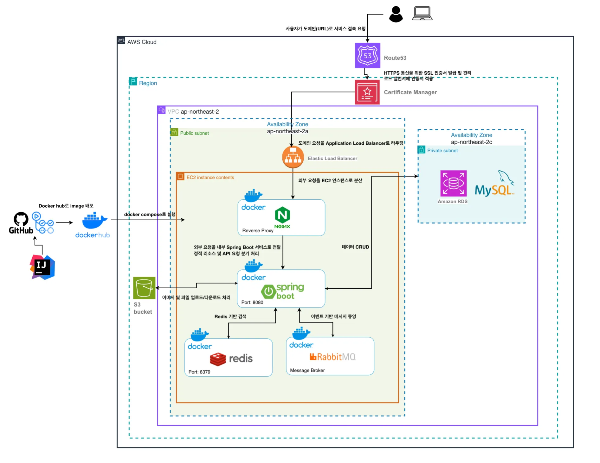

# 3. FarmON - 농업인↔전문가 매칭 플랫폼

프로젝트 유형: IT 연합 동아리 UMC 7기
프로젝트 설명: 농업인과 농업 전문가를 연결하는 매칭 플랫폼
사용 기술: k6, Prometheus, Grafana, JAVA, SpringBoot, QueryDSL, JWT, Nginx, RabbitMQ, STOMP, WebSocket, AWS, Docker, MySQL, Redis, React, JavaScript, CoolSMS
담당 역할: 백엔드(팀장, SpringBoot), 서버 인프라 설계, CI/CD, 동시성 이슈 해결
작업기간: 2025년 1월 5일 → 2025년 2월 21일
GitHub 링크: https://github.com/mmije0ng/FarmON_BE_LoadTesting

## ***Overview***

---

**농업인과 농업 전문가를 연결하는 매칭 플랫폼**

- 디지털 커뮤니티를 통해 소규모 영세농업의 공동농업을 활성화
- 전국의 농업 전문가를 연결하며, 농업 데이터를 기반으로 체계적인 농업 서비스를 제공

## *Tech Stack*

---

서비스 아키텍처

| 구분 | 내용 |
| --- | --- |
| **Backend** | JAVA, SpringBoot, JPA, QueryDSL, SpringSecurity, JWT, CoolSMS |
| **DataBase** | MySQL, Redis |
| **Messaging** | RabbitMQ, WebSocket, STOMP |
| **Load testing & Monitoring** | k6, Prometheus, Grafana |
| **DevOps** | Docker, AWS(EC2, ALB, Route53, ACM, RDS, S3), Nginx, GitHub Actions |
| **Frontend** | React, TypeScript, Vite, Netlify |

## *P**articipants***

---

- **총 10명**: PM 1명, 디자이너 1명, 백엔드 4명, 웹 프론트엔드 4명

## *Contributions*

---

1. **RabbitMQ 기반 실시간 채팅 구현**: RabbitMQ 메시지 브로커를 도입해 채팅 메시지의 유실을 방지하고, 입장·퇴장·텍스트 전송을 메시지 타입별로 분리
2. **Redis 기반 검색 기능 구현**: 자동완성·추천·최근 검색·검색어 삭제 기능을 설계하여 빠른 검색 경험 제공
3. **부하테스 및 성능최적화**: 동시 사용자 1,000명 규모의 테스트 후 병목 구간을 모니터링 해, Redis 캐시를 도입하여 응답 지연 시간 70%, 시스템 처리 용량 2.8배 확장
4. **Spring Security 역할 기반 접근 제어**: 농업인·전문가 권한을 실시간 전환 가능하도록 설계하고 역할 별 접근 제어 적용
5. **CI/CD 및 배포 환경 구축**: Docker와 AWS 인프라를 활용해 컨테이너 기반 배포 환경을 구성하고, GitHub Actions를 통해 CI/CD 파이프라인 구축
6. **백엔드 팀장 역할 수행**: API·ERD 설계, Swagger 문서화 및 백엔드 개발 방향과 일정 관리 주도

## *부하 테스트 및 성능 최적화*

---

### 홈 화면 API 단계별 최적화 및 동시 사용자 1,000 VUs 가용성 검증

본 문서는 홈 화면 커뮤니티 게시글 조회 API를 대상으로 k6를 활용해 **동시 사용자 1,000명 규모의 부하 테스트**를 수행하고,
Prometheus와 Grafana를 통해 주요 성능 지표를 모니터링하며 **시스템의 성능 한계**와 **병목 지점**을 분석하여 개선한 과정을 정리했습니다.

### 1. 실험 개요 및 환경

### 1.1 실험 환경 및 시나리오

- **테스트 도구**: k6 (ramping-vus)
- **테스트 시나리오**: 32분간 가상 사용자(VU)를 1 -> 1,000까지 13단계에 걸쳐 점진적 증가
- **대상 API**: 홈 화면 카테고리별 게시물 정보 반환 API (좋아요/댓글 수 포함)
- **모니터링**: Prometheus, Grafana
- **백엔드**: Spring Boot(3.0.0), Java(17)
- **인프라**: AWS (EC2, RDS), Docker

### 1.2 실험 지표 및 목표

- **에러율 (http_req_failed)**: 목표 < 1.0%
- **응답 시간 (http_req_duration)**: 핵심 목표 p(95) < 2.0s / 가이드라인 p(99) < 5.0s
- **처리량 (http_reqs)**: VU 증가에 따른 RPS(Throughput) 선형 증가 여부 확인

### 2. [v1] Baseline: 기존 코드 분석 (N+1 발생 구조)

### 기존 로직 및 문제점

- **데이터 조회 구조**: 게시글 목록 조회(1회) + 각 게시물별 좋아요 COUNT(N회) + 댓글 COUNT(N회)
- **병목 원인**: 총 **1 + 2N 쿼리**가 발생하여, 트래픽 증가 시 DB I/O 부하 및 커넥션 점유 시간 급증

### 2.1 구간별 성능 변화 분석

- **① [안정 구간] VUs 0~500명**: RPS가 선형적으로 상승하며 p(95) 1초 미만 유지.
- **② [지연 발생 구간] VUs 500~800명**: 500명 지점에서 **성능 변곡점(Elbow Point)** 발생. 요청이 Queue에 쌓이며 지연 시간 급증.
- **③ [붕괴 및 임계 구간] VUs 800~1,000명**: p(95) 응답 시간이 **6.7s**로 치솟으며 RPS는 **155 req/s**에서 정체(Saturation).

### 2.2 실험 결과 (1,000 VUs)

| 지표 항목 | 측정 결과 | 판정 및 의미 |
| --- | --- | --- |
| **p(95) Latency** | **6.7s** | **Fail**: 목표치(2s) 대비 3배 이상 지연 |
| **p(99) Latency** | **7.94s** | **Fail**: 최악의 상황 응답성 붕괴 |
| **Peak RPS** | **155 req/s** | 인프라 환경의 물리적 처리 한계 노출 |
| **Error Rate** | **0.00% (15건)** | `dial: i/o timeout` 등 소수 하드 에러 발생 |

### 3. [v2] 1차 개선: QueryDSL 기반 단일 조회 (N+1 제거)

### ✅ 변경 사항

- **쿼리 통합**: QueryDSL을 이용해 `JOIN` 및 `GROUP BY`를 활용한 **단일 집계 쿼리**로 리팩토링
- **최적화 기법**: `COUNT(DISTINCT ...)`를 적용하여 조인 시 중복 집계 방지
- **DTO Projection**: Entity 대신 조회 전용 DTO(**HomePostRow**)를 사용하여 영속성 컨텍스트 부하 절감

### 3.1 구간별 성능 변화 분석

- **① [성능 개선 확인]**: 이전 테스트 대비 RPS가 **최대 268.29 req/s**까지 상승하며 연산 효율 **88%** 향상 입증.
- **② [병목 잔존]**: 600 VUs 이후 처리량은 늘었으나 DB 커넥션 자원 부족으로 인한 타임아웃 경고 재발생.
- **③ [지연 감소]**: p(95) 응답 시간은 **3.38s**로 v1 대비 약 **50% 개선**되었으나 목표치(2s)에는 미달.

### 3.2 성능 지표 비교 (v1 vs v2)

| 지표 항목 | v1 (Baseline) | v2 (로직 최적화) | 성과 |
| --- | --- | --- | --- |
| **p(95) Latency** | 6.7s | **3.38s** | **50% 단축** |
| **Avg Throughput** | 142.4 req/s | **268.29 req/s** | **88% 향상** |
| **Peak RPS** | 155 req/s | **312 req/s** | **101% 향상** |

### 4. [v3] 2차 개선: 인프라 설정 최적화 (WAS/DB 튜닝)

### ✅ 변경 사항

- **HikariCP**: `maximum-pool-size: 30`, `connection-timeout: 30000` (커넥션 부족 해소)
- **Tomcat**: `threads.max: 400`, `max-connections: 8192` (동시 요청 수용량 증대)
- **RDS**: DB 파라미터 그룹 수정을 통해 `max_connections: 300` 확보

### 4.1 구간별 성능 변화 분석

- **① [인프라 병목 해소]**: v2 대비 Peak RPS가 **358 req/s**로 약 **130%** 상승하며 설정 튜닝 효과 입증.
- **② [처리 용량 극대화]**: 총 처리 요청 수 **584,006건**으로 확장.
- **③ [물리 임계점 식별]**: 설정을 확장했음에도 p(95)가 **3.30s**에서 정체됨. 현재 구조상 **물리적 Disk I/O 포화**로 판단됨.

| **지표 항목** | **v1 (Baseline)** | **v2 (로직 최적화)** | **v3 (설정 최적화)** | **v1 vs v3 비교 (최종 성과)** | **v2 vs v3 비교 (설정 효과)** |
| --- | --- | --- | --- | --- | --- |
| **p(95) Latency** | 6.7s | 3.38s | **3.30s** | **51% 단축**: 사용자 체감 응답 속도 혁신 | **미세 개선**: 설정 튜닝으로 대기 시간 최적화 |
| **Avg RPS** | 142.4 | 268.29 | **300.49** | **111% 향상**: 초당 처리 능력 2배 이상 확장 | **12% 향상**: 설정 최적화로 처리 효율 추가 확보 |
| **Peak RPS** | 155 | 312 | **358** | **130% 향상**: 고부하 대응 한계치 대폭 상향 | **15% 향상**: 억제된 잠재 성능 완전 개방 |
| **Fail (에러)** | 15건 | 36건 | **35건** | **주의**: 처리량 증가에 따른 타임아웃 발생 | **유지**: RDS 자원의 물리적 포화 상태 식별 |
| **Total Req** | 27.7만 | 52.0만 | **58.4만** | **2.1배 증가**: 시스템 전체 가용 용량 극대화 | **12% 증가**: 동일 시간 내 수용량 극대화 |

### 5. [v4] 개선: Redis 캐시 도입 (In-memory 아키텍처)

### ✅ 변경 사항

- **캐싱 전략**: 홈 커뮤니티 데이터를 `category:{PostType}` 키 구조로 **Redis**에 저장 (In-memory)
- **유효 정책**: `TTL 60초` 적용 및 좋아요/댓글 변경 시 `afterCommit` 시점에 **선택적 캐시 무효화(Evict)**
- **직렬화**: `GenericJackson2JsonRedisSerializer`를 통한 DTO 직렬화

### 5.1 구간별 성능 변화 분석

- **① [응답 혁신]**: 물리 Disk를 타지 않는 조회로 p(95) 응답 시간을 **2.56s**로 단축 (**v3 대비 22% 추가 개선**).
- **② [RPS 극대화]**: Peak RPS **498** 달성. 시스템 처리 용량이 초기 대비 약 **3.2배** 확장됨.
- **③ [안정성 유지]**: 총 요청 수 **77.3만 건**으로 폭증했으나, **에러율 0.009%**로 신뢰성 있는 응답 유지.

### 5.2 성능 지표 비교 (v1 ~ v4)

| **지표 항목** | **v1 (Baseline)** | **v2 (로직 최적화)** | **v3 (설정 최적화)** | **v4 (Redis 도입)** | **v1 vs v4 (전체 성과)** | **v2 vs v4 (캐시 효과)** | **v3 vs v4 (한계 돌파)** |
| --- | --- | --- | --- | --- | --- | --- | --- |
| **p(95) Latency** | 6.71s | 3.38s | 3.30s | **2.56s** | **62% 단축**: 지연 시간 혁신적 개선 | **24% 추가 단축**: DB I/O 의존도 감소 | **0.74s 단축**: 설정으로 못 깬 벽을 기술로 해결 |
| **Throughput (Avg RPS)** | 142.4 | 268.29 | 300.49 | **401.7** | **182% 향상**: 처리 능력 약 3배 확장 | **49% 향상**: 로직 최적화 이상의 효율 달성 | **33% 향상**: 인프라 가동 효율 극대화 |
| **Peak RPS** | 155 | 312 | 358 | **498** | **221% 향상**: 고부하 대응력 완성 | **59% 향상**: RPS 500대 근접 달성 | **40% 향상**: 설정 최적화 한계 돌파 |
| **Fail (에러)** | 15건 | 36건 | 35건 | **72건** | **안정성 유지**: 0.009%의 극히 낮은 에러율 | **리소스 경합**: 처리량 폭증에 따른 미세 상승 | **물리 한계**: 단일 인스턴스 자원 포화 확인 |
| **Total Requests** | 27.7만 | 52.0만 | 58.4만 | **77.3만** | **2.8배 증가**: 가용 용량 비약적 성장 | **48% 증가**: 데이터 처리 효율 극대화 | **32% 증가**: 시스템 가용성 최종 경신 |

### 6. 최종 성능 개선 목표 및 달성 현황

| 구분 | 목표치 (Thresholds) | v1 (기존) | v4 (최종) | 결과 |
| --- | --- | --- | --- | --- |
| **p(95) Latency** | **2.0s 미만** | 6.71s | **2.56s** | **미달 (CPU 자원 임계)** |
| **p(99) Latency** | **5.0s 미만** | 7.94s | **3.98s** | **통과** |
| **Error Rate** | **1.0% 미만** | 0.005% | **0.009%** | **통과** |

**향후 목표**:

로직, 인프라, 캐싱 최적화를 통해 비약적인 성능 향상을 거두었으나, 1,000 VU 환경에서 단일 인스턴스의 CPU 부하로 인해 p(95) 2.0s 목표에는 미달했습니다. 향후 **인스턴스 확장(Scale-out)** 및 **로드밸런서(ALB)** 적용을 통해 자원 부하를 분산하고 최종 목표 지표를 달성할 예정입니다.

## *Problem Solving*

---

### 1. **채팅 메시지 유실 방지 및 통신 신뢰성 확보**

- **문제:** 기존 Spring 내장 브로커(In-memory) 기반의 STOMP 환경에서는 서버 장애나 대규모 트래픽 발생 시 메모리에 머물던 메시지가 유실될 위험이 존재함.
- **해결:** 외부 전용 메시지 브로커인 **RabbitMQ**를 도입하여 STOMP와 연동하고, 메시지 큐잉 및 라우팅 처리를 위임.
- **결과:** 메시지 영속성(Durability)을 확보하여 서버 재시작이나 일시적인 장애 시에도 메시지를 안전하게 보존하고 전달할 수 있어 채팅 시스템의 안정성 향상.

### 2. 채팅 메시지 조회 시 N+1 문제 제거

- **문제**: 메시지 조회 후 전송자 정보 접근 시 메시지 수만큼 추가 쿼리 발생
- **해결**: Lazy 연관 접근 제거 및 QueryDSL 단일 조회 쿼리로 리팩토링하여 쿼리 수 1회 고정
- **결과**: 채팅 메시지 무한 스크롤 API의 성능 안정성 확보

### 3. Service 계층 책임 분리 및 트랜잭션 최적화

- **문제**: 조회/수정 로직 혼재로 불필요한 트랜잭션 범위 확장 및 성능 저하
- **해결**: CommandService(쓰기)와 QueryService(읽기)로 명확히 분리 (CQRS 패턴 적용)
- **결과**: `@Transactional(readOnly = true)` 적용으로 조회 성능 개선 및 유지보수성 향상

## ***Resources***

---

프로젝트 링크

- GitHub: 
 - 부하테스트: [https://github.com/mmije0ng/FarmON_BE_LoadTesting](https://github.com/mmije0ng/FarmON_BE_LoadTesting)
 - 개발: [https://github.com/Farm-On/BE](https://github.com/Farm-On/BE)
- 배포 링크: [https://farm-on.netlify.app/](https://farm-on.netlify.app/) *(서버 비용으로 인해 현재 서비스 중단)*
