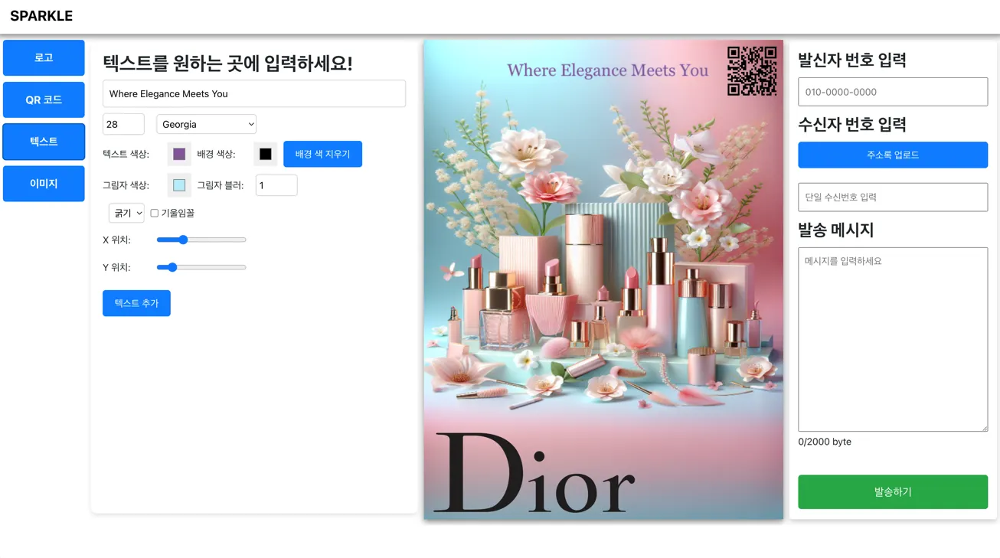
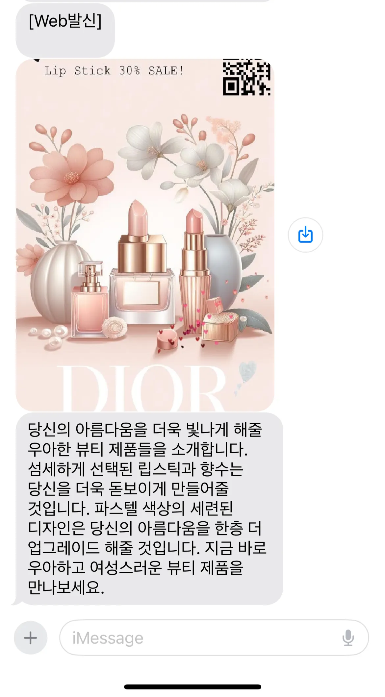
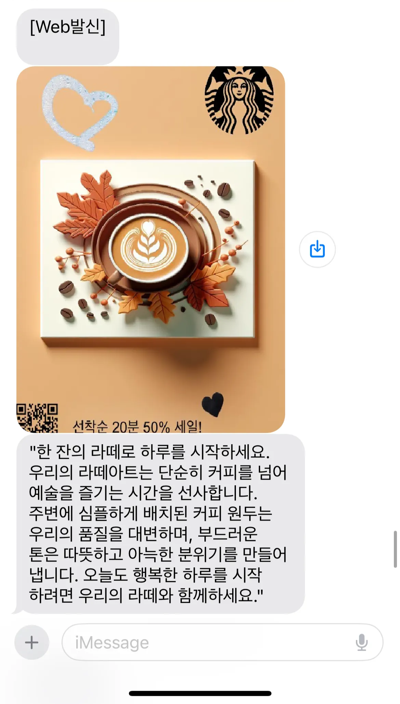
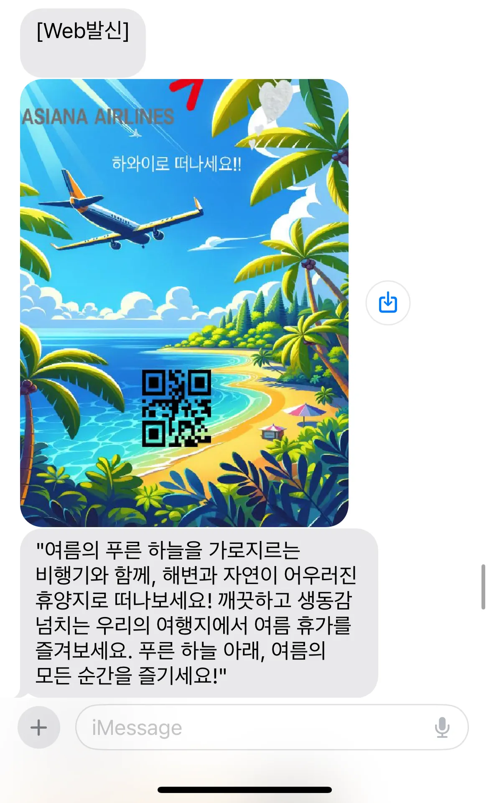

# 5. AI 템플릿 메이커 - AI 기반 광고 이미지 제작·문자 발송 서비스

프로젝트 유형: 2024 한성SW중심대학 페스티벌, 다우기술 기업 연계 프로젝트
프로젝트 설명: 생성형 AI로 제작한 광고 이미지를 템플릿으로 꾸며 문자로 발송하는 웹 서비스
2024 한성SW중심대학 페스티벌 우수상
이미지 생성 응답 시간을 비동기 구조로 개선하여 약 5배 단축

사용 기술: DALL·E 3, OpenAI, Azure, JAVA, SpringBoot, 뿌리오, React, JavaScript
담당 역할: 백엔드(SpringBoot), AI
작업기간: 2024년 9월 17일 → 2024년 11월 29일
GitHub 링크: https://github.com/HSU-SPARKLE/Pre-Capstone-BE

AI로 광고 이미지 생성 후, 템플릿 기능으로 이미지 꾸미기

## ***Overview***

---

본 서비스는 **다우기술**의 문자 발송 서비스인 **뿌리오**와 연계해 개발된 **한성대학교 SW프리캡스톤디자인 프로젝트**입니다.

**AI 템플릿 메이커**는 생성형 AI와 템플릿 기능을 결합해 **소상공인 및 소기업**(예: 음식점, 카페, 여행사, 소규모 쇼핑몰 등)이 손쉽게 광고 이미지를 제작하고 꾸밀 수 있도록 지원하는 서비스입니다.

사용자는 생성형 AI로 원하는 광고 이미지와 광고 메시지를 제작한 후, 생성된 이미지는 서비스 내 **템플릿 기능**을 활용해 **로고, QR 코드, 텍스트, 추가 이미지**를 삽입하여 사용자의 의도대로 광고 이미지를 완성할 수 있습니다.

또한, **뿌리오 API**와의 연동을 통해 생성된 이미지를 원하는 수신자에게 문자로 간편하게 전송할 수 있습니다.

## *Tech Stack*

---

서비스 아키텍처

| 구분 | 내용 |
| --- | --- |
| **Backend** | JAVA, SpringBoot, JPA, 뿌리오 API |
| **AI** | DALL·E 3, OpenAI |
| **DataBase** | MySQL |
| **DevOps/Cloud** | Azure (OpenAI, Blob Storage, Text Analytics) |
| **Frontend** | React, JavaScript,Unsplash, Remove.bg |

## *P**articipants***

---

- **총 5명**: 백엔드 3명, 웹 프론트엔드 2명

## *Contributions*

---

**1. DALL·E-3 기반 비동기 이미지 생성 로직 구현**

- 뿌리오의 요구사항을 반영한 글자와 사람이 포함되지 않은 깔끔하고 미니멀한 디자인의 이미지를 생성합니다.
- 사용자가 광고하고자 하는 의도에 맞게 이미지 및 텍스트를 수월하게 삽입하기 위한 단색 배경 위주의 이미지 생성합니다.
- 스타일 별로 3장의 이미지를 생성하여 사용자가 원하는 스타일의 이미지를 선택할 수 있도록 제공합니다.
    - **애니메이션 스타일**
    - **사실적인 포토 스타일**
    - **일러스트 스타일**

해당 이미지는 서비스에서 발송 목적 및 내용 입력 후, DALLE-3를 기반으로 생성된 이미지 입니다.

**2. 광고 문자 자동 생성 로직 구현**: OpenAI와 Azure Text Analytics를 연동하여 맞춤형 광고 카피 자동화

- OpenAI를 활용하여 사용자가 입력한 발송 목적 및 내용을 분석하고 이를 기반으로 효과적인 광고 문구를 생성합니다.
- 생성된 광고 문자는 엑셀 파일 형태로 업로드된 주소록과 연동되며, 뿌리오 API를 통해 원하는 수신자들에게 손쉽게 발송할 수 있습니다.

**3. Azure Blob Storage 연동:** 생성된 이미지의 안정적인 저장 및 관리 기능 구현

**4. 설계 및 명세:** ERD 설계, Swagger 기반 API 명세서 작성, 서비스 와이어프레임 작성

## *Problem Solving*

---

### 1. 생성형 AI 이미지 생성 성능 최적화

- **문제**: 다중 이미지 생성 요청이 순차적으로 처리되어 응답 시간이 과도하게 길어지고 병목 현상 발생
- **해결**:
    - 이미지 생성 요청을 **비동기 병렬 처리** 구조로 전환
    - 광고 문구 생성 로직을 분리하고 외부 API 변동성에 대비해 **지수형 대기(선형 증가) 재시도**를 적용해 실패 내성을 확보
- **결과**: **3장의 이미지 생성**을 **비동기**로 전환하여 **생성 과정의 병목 현상을 해소**하여 **응답 지연 시간을 약 40초 → 8초로 단축**하며, **속도를 약 5배 개선**

### 2. AI 이미지 품질 안정화 및 사용자 의도 반영 구조 개선

- **문제**: 생성형 AI가 이미지 내부의 텍스트를 생성할 때 발생하는 텍스트 깨짐 및 노이즈 이슈
- **해결**:
    - **역할 분리**: AI는 배경 이미지만 생성하고, 문구·로고·QR 코드는 사용자가 **템플릿** 위에서 직접 배치하도록 설계
    - **프롬프트 정규화**: Azure Text Analytics로 사용자 입력 문장의 키워드를 추출하여 정밀한 프롬프트 구성
- **결과**: 키워드 추출 기반 프롬프트 정규화로 **이미지 품질 편차 감소** 및 **브랜드 톤·스타일 일관성** 달성, 이미지 품질의 일관성을 확보하고 사용자 맞춤형 편집 자유도 향상,

### 3. 템플릿 이미지 합성 시 이질감 문제 해결

- **문제**: AI 생성 이미지 위에 사용자 추가 이미지를 삽입할 때 배경 및 톤 차이로 인한 시각적 부조화 발생 (기업 심사 피드백 사항)
- **해결**: [**Remove.bg](http://remove.bg/) API를 활용**하여 삽입 이미지의 배경을 사전에 제거하는 전처리 과정 추가
- **결과**: 템플릿 이미지와의 시각적 일관성을 높여 자연스러운 광고 이미지 합성 결과물 구현

## ***Resources***

---

프로젝트 링크

- GitHub: [https://github.com/HSU-SPARKLE/Pre-Capstone-BE](https://github.com/HSU-SPARKLE/Pre-Capstone-BE)

관련 자료

- 기업 중간심사 내역: [Google Sheets](https://docs.google.com/spreadsheets/d/1nn-Tsn0zAhAgpwlAL61T6TFzuBpaGhqK/edit?usp=sharing&ouid=104382857428857441544&rtpof=true&sd=true)
- 발표 자료: [Google Slides](https://docs.google.com/presentation/d/1b3fbE769EsdSu17olbOQh9xI2FILTWYv/edit?slide=id.p1#slide=id.p1)
- 판넬: [Google Slides](https://docs.google.com/presentation/d/1ym5PQ3CEQXgFXTu9sYUEGAM4eGppizeC/edit?usp=sharing&ouid=104382857428857441544&rtpof=true&sd=true)
- 와이어프레임: [Figma 바로가기](https://www.figma.com/design/m3lABpF8fay84QkItHprxC/sw-%ED%94%84%EB%A6%AC%EC%BA%A1%EC%8A%A4%ED%86%A4-%EC%8A%A4%ED%8C%8C%ED%81%B4?node-id=0-1&t=HgSjvoGbJSAj2nWH-1)