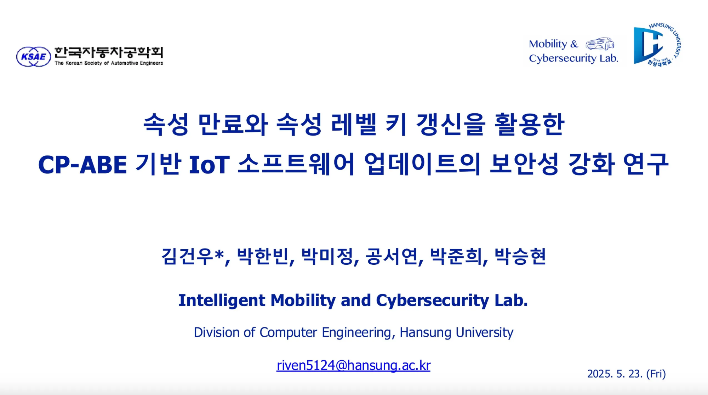

# 1. 속성 만료와 속성 레벨 키 갱신을 활용한 CP-ABE 기반 IoT 소프트웨어 업데이트의 보안성 강화 연구

프로젝트 유형: 2025 자동차공학회 춘계학술대회
프로젝트 설명: 2025 한국자동차공학회 춘계학술대회 사이버보안 세션 논문 투고
작업기간: 2025년 3월 12일 → 2025년 5월 23일
논문 링크: https://www.ksae.org/journal_list/search_index.php?mode=view&sid=57152

https://www.ksae.org/workshop/202501/

## 개요

본 연구는 **IoT 환경에서 대규모 소프트웨어 업데이트의 보안을 강화**하기 위해, 기존 하이브리드 암호화 및 CP-ABE 기법의 한계를 보완하고 **동적 속성 반영, 확장성 확보, 효율적인 속성 갱신**을 달성하는 **Dynamic CP-ABE(Ciphertext-Policy Attribute-Based Encryption)** 기법을 제안합니다.

---

## 연구 배경

- **하이브리드 암호화(비대칭키 + 대칭키)**
    - 기밀성, 무결성은 제공하나 기기 수가 증가할수록 제조사의 연산 부담 증가.
- **기존 CP-ABE**
    - 정책 기반 접근 제어 및 확장성 제공.
    - 그러나 차량 보증기간, 구독 서비스 여부와 같은 **실시간 동적 속성 반영이 어려움**.
- 따라서 **보안성과 확장성을 동시에 만족하면서 동적 속성까지 처리 가능한 기법**이 필요.

---

## 연구 목표

- 동적 속성을 효율적으로 반영할 수 있는 **Dynamic CP-ABE** 설계.
- 기존 기법(Hybrid, CP-ABE)과의 성능 비교를 통해 **우수성 검증**.
- IoT 환경에서 확장 가능한 보안 업데이트 아키텍처 제안.

---

## 제안 기법: Dynamic CP-ABE

- **속성 만료 관리**: 특정 시점 이후 속성이 자동으로 무효화되도록 지원.
- **속성 레벨 키 갱신**: 전체 키를 재발급할 필요 없이 필요한 속성만 갱신.
- **정책 기반 접근 제어 유지**: 기존 CP-ABE와 동일하게 정책 단위의 접근 제어 제공.
- **확장성 확보**: 기기 수 증가에 따른 성능 저하 방지.

---

## 실험 결과

### 확장성 평가

- Hybrid: 기기 수 증가에 따라 선형적 시간 증가 (5000대 기준 148.46ms).
- 기존 CP-ABE 및 제안 기법: 기기 수와 무관하게 일정한 시간 유지.
- **Dynamic CP-ABE**: 5000대 기준 19.61ms로 가장 우수.

### 속성 갱신 효율성

- 기존 CP-ABE: 단일 속성 갱신 불가 → 전체 키 갱신 필요 (50개 속성 기준 723.2초).
- Dynamic CP-ABE: 단일 속성 갱신 가능 → 속성 수와 무관하게 일정 (50개 기준 90.3초).

### 시간 기반 접근 제어

- 만료 전: 정상 접근 가능.
- 만료 후: 자동 차단 → 안정적 접근 제어 검증 완료.

---

## 결론

- Dynamic CP-ABE는 기존 기법 대비 **접근 제어 유연성, 속성 관리 효율성, 확장성** 측면에서 우수성을 입증.
- IoT 소프트웨어 업데이트의 보안성을 강화하면서도, 대규모 환경에서 실질적으로 활용 가능함을 확인.

---

## 향후 연구 방향

- 대규모 IoT 환경에서의 **확장형 속성 관리 구조** 설계.
- 경량 기기에 적합한 **경량 인증 및 암호 연산 최적화**.
- **블록체인 기반 로그 무결성**과의 결합 연구.

---

## 향후 개선 사항

- 실험은 시뮬레이션(Charm-crypto 기반)으로 진행 → 실제 하드웨어 환경 차이 존재.
- 기기-CA 간 안전한 키 전송 메커니즘 보완 필요.
- 오프라인 기기 환경에서 시계 동기화 문제 해결 필요.
- CP-ABE 특유의 높은 연산량으로 인한 제약 검증 필요.

---

## 참고 문헌

- Waters, B., *Ciphertext-Policy Attribute-Based Encryption: An Expressive, Efficient, and Provably Secure Realization*.
    
    [[논문 보기 (IACR ePrint)](https://eprint.iacr.org/2008/290.pdf)]
    
- IEEE, *Secure, Selective Group Broadcast in Vehicular Networks Using Dynamic Attribute-Based Encryption*.
    
    [[논문 보기 (IEEE Xplore)](https://ieeexplore.ieee.org/abstract/document/5546877)]
    
- Eprint, *Updating Attribute in CP-ABE: A New Approach*.
    
    [[논문 보기 (IACR ePrint)](https://eprint.iacr.org/2012/496)]
    

---

## 발표 및 투고

- 본 연구는 **2025년 한국자동차공학회 춘계학술대회**에 논문으로 투고되었으며, **자동차 사이버보안 세션**에서 발표를 진행.

---

## 논문 정보

https://www.ksae.org/journal_list/search_index.php?mode=view&sid=57152

[속성 만료와 속성 레벨 키 갱신을 활용한 기반 소프트웨어 CP-ABE IoT 업데이트의 보안성 강화 연구.pdf](%EC%86%8D%EC%84%B1_%EB%A7%8C%EB%A3%8C%EC%99%80_%EC%86%8D%EC%84%B1_%EB%A0%88%EB%B2%A8_%ED%82%A4_%EA%B0%B1%EC%8B%A0%EC%9D%84_%ED%99%9C%EC%9A%A9%ED%95%9C_%EA%B8%B0%EB%B0%98_%EC%86%8C%ED%94%84%ED%8A%B8%EC%9B%A8%EC%96%B4_CP-ABE_IoT_%EC%97%85%EB%8D%B0%EC%9D%B4%ED%8A%B8%EC%9D%98_%EB%B3%B4%EC%95%88%EC%84%B1_%EA%B0%95%ED%99%94_%EC%97%B0%EA%B5%AC.pdf)

---

## 학술대회 발표자료

[자동차공학회_Dynamic CP-ABE.pdf](%E1%84%8C%E1%85%A1%E1%84%83%E1%85%A9%E1%86%BC%E1%84%8E%E1%85%A1%E1%84%80%E1%85%A9%E1%86%BC%E1%84%92%E1%85%A1%E1%86%A8%E1%84%92%E1%85%AC_Dynamic_CP-ABE.pdf)